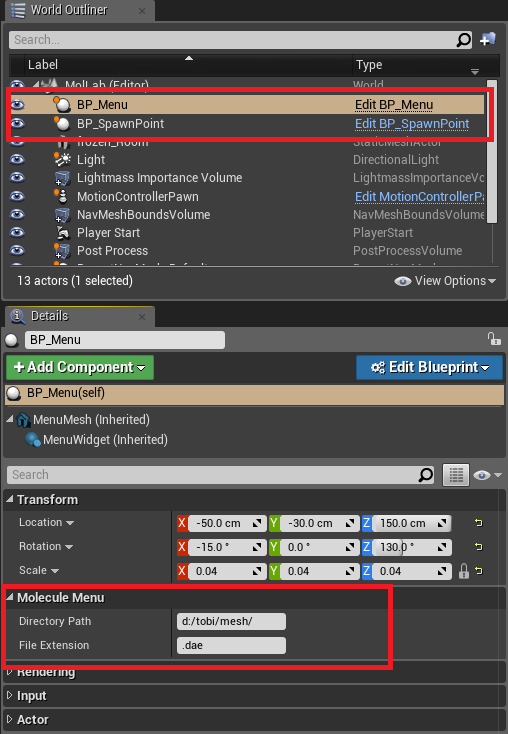

# MoleculeVR

This aim of this project is to let user experience, inspect and modify molecules in an virtual reality environment.

# Requirements

MoleculeVR is build with the Unreal Engine (currently 4.16).

For further development you also need to install the [Runtime Mesh Component Plugin](https://www.unrealengine.com/marketplace/runtime-mesh-component) via the Unreal Marketplace.

Libraries used are assimp and dirent.h.

# Usage

Start the project in the Unreal Editor and make sure the menu (BP_Menu) and a spawnpoint (BP_Spawnpoint) are added to to map.

Moreover you have to specify a directory on your harddisk where the menu should look for the molecule mesh and the fileending.

Currently \*.dae files work best for me, since they can be exported directly with PyMol.

You can see the map _Mol_Lab_ for an example.

# License

This project is published under MIT License.
